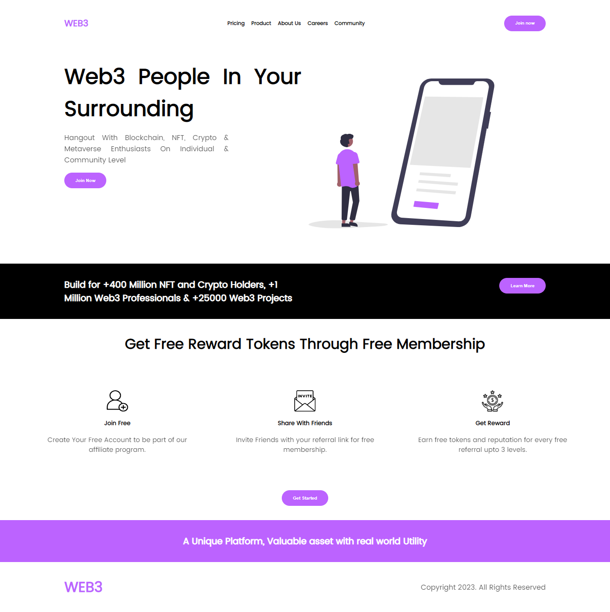

# LANDING PAGE

This is a solution to the [Level 1 Task 1](https://www.linkedin.com/company/oasis-infobyte/mycompany/) Oasis Infobyte Web Design and Development internship.

### Screenshots

<table>
        <tr>
		    <td>
                
            </td>
        </tr>
</table>

## My process

### Built with

- HTML
- CSS
- Flexbox
- CSS Grid
- [Vite](https://vitejs.dev/) - Next Generation Frontend Tooling

### What I learned

I learned new CSS properties like min( ) and not( ). It was a great opportunity and challenge to imporve my frontend skills.

(<a href="#top">back to top</a>)

